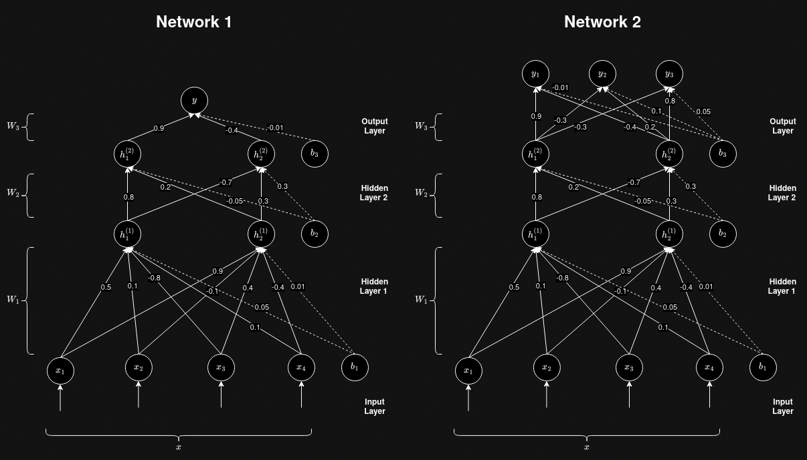

# Exercise 3

This is the third exercise for the course [Deep Learning](https://lehre.idh.uni-koeln.de/lehrveranstaltungen/wintersemester-2024-2025/deep-learning/).

Clone this repository to your local setup. Create a branch with the name of your GitHub account and switch to it.

In the repository, you find the file `ffnn.py` with five empty functions:

- `FFNN()`
- `ReLU()`
- `sigmoid()`
- `softmax()`

Finish all functions.

Implement the `FFNN()` function in such a way that it replicates the neural networks shown in the following:



If the `m̀ode`-option is set to "binary", the function should return a single probability (Network 1), if it is set to "multiclass", the function should return a vector of probabilities (Network 2).
The function takes in a vector with four components as input.

Use the `ReLU()` function as the activation function for all hidden layers in both networks and the `sigmoid()` and `softmax()` function as the
activation function for the output layer, depending on the value of the `mode` option.

Test your two functions with different inputs and observe the differences in output.

Commit your changes and push them to the branch with the name of your GitHub account.

Deadline for this exercise is October 31, 2024, 08:00:00 CET.

## Hints

In order to work with vectors and general math, you can use the `numpy` library in Python.
Import it with

```{python}
import numpy as np
```

You can then define vectors with:
```{python}
v = np.array([1,2,3])
```

For the dot product, use `np.dot()` with two numpy arrays as input.
You can calculate the sum of a numpy array with `np.sum()`.
The `ǹp.add()` function gives the sum of two vectors.
Use `np.exp()` to calculate the exponent to the base e (works with integers and numpy arrays).

The `max()` function returns the maximum of two inputs.
